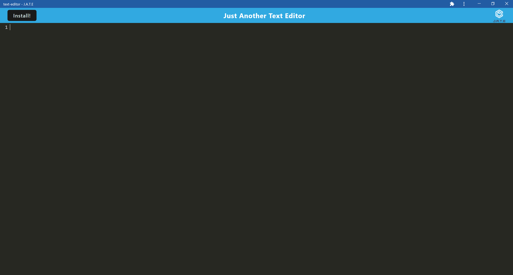
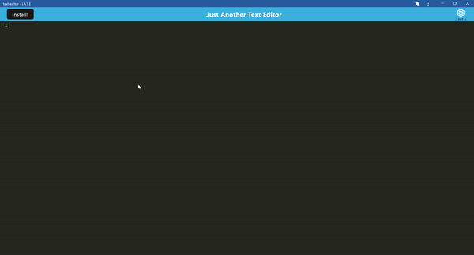

# [PWA: Text Editor][deployed]

This is a web application is a single-page text-editor application designed to create notes or code snippets.

## Table of Contents

- [Technologies](#technologies))
- [Software Demo](#demo)
- [Credits](#credits)

## Technologies Used

- HTML
- CSS
- Javascript
- Node.js
- Express.js
- Heroku
- HMR
- IndexedDB

The application utilizes Express.js for its back end.

## Demo

 

 

## Credits

UCB - Coding Bootcamp

---

© 2022 Clement Koo. All Rights Reserved.
[LinkdIn](https://www.linkedin.com/in/clement-t-k-459322138/) |
[GitHub](https://github.com/C-K999)

[deployed]: https://ck-text-editor.herokuapp.com/
